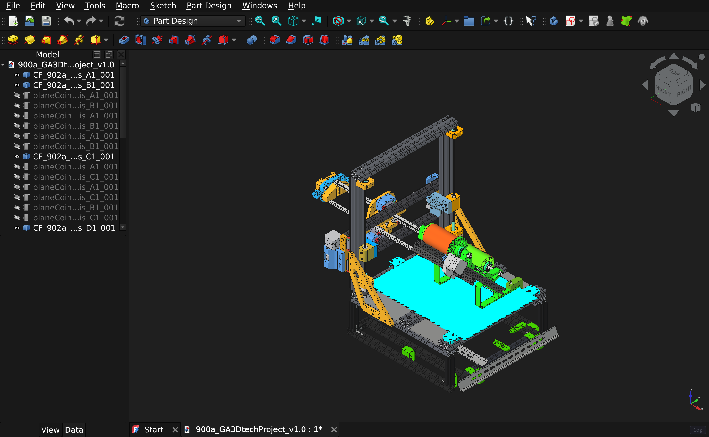
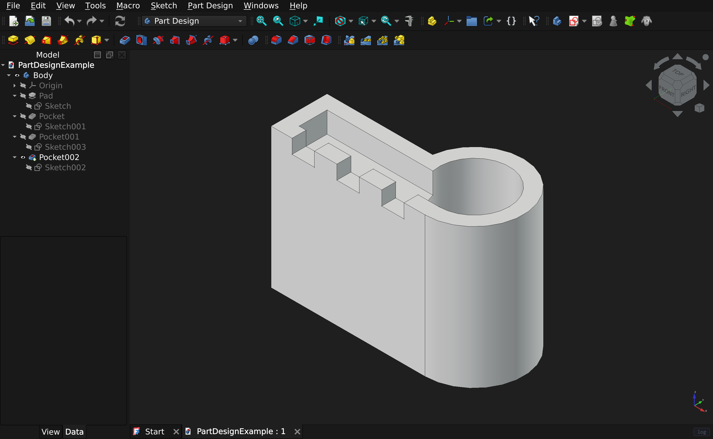
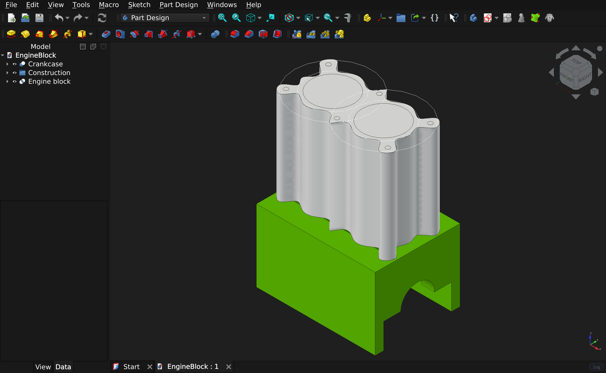
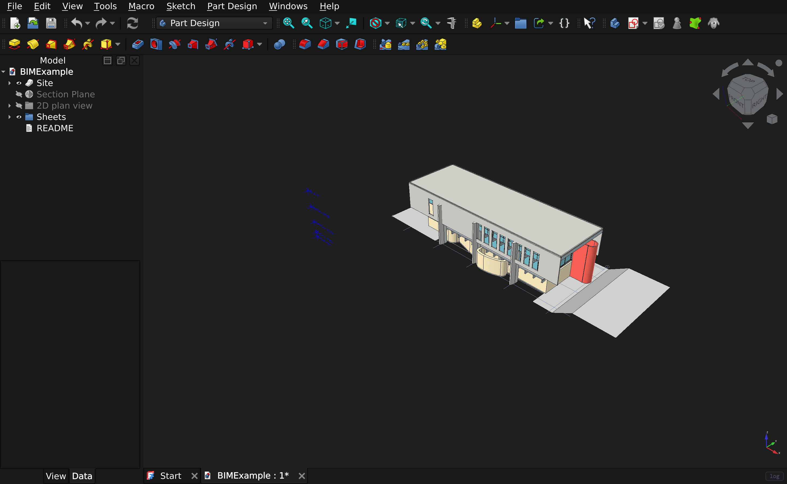
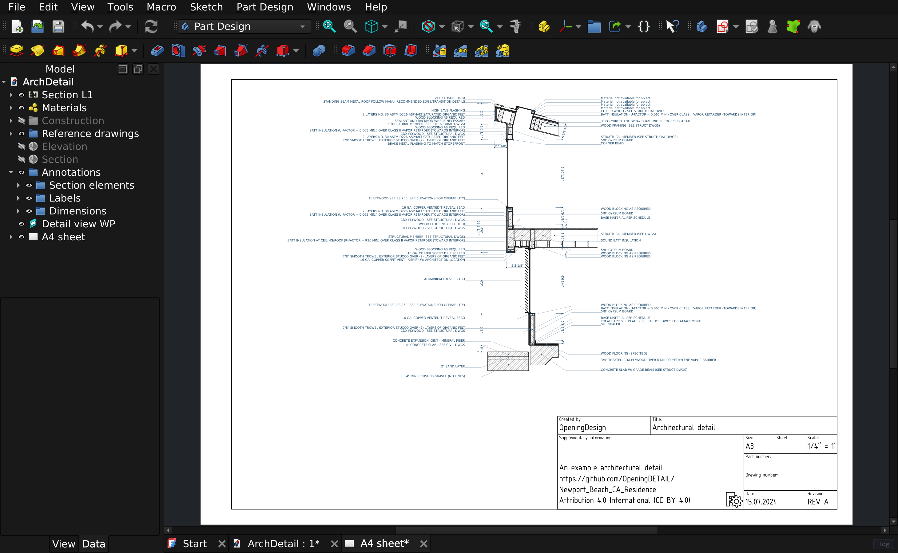
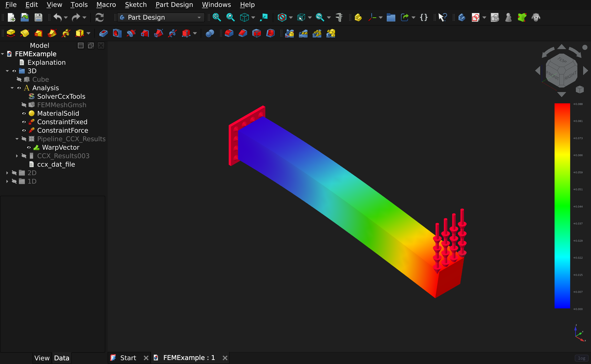
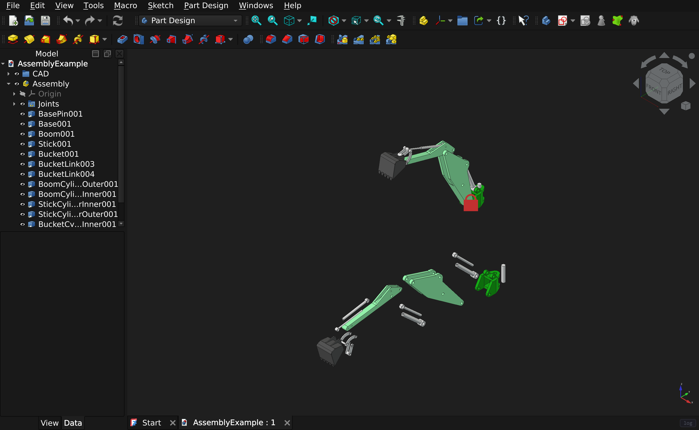
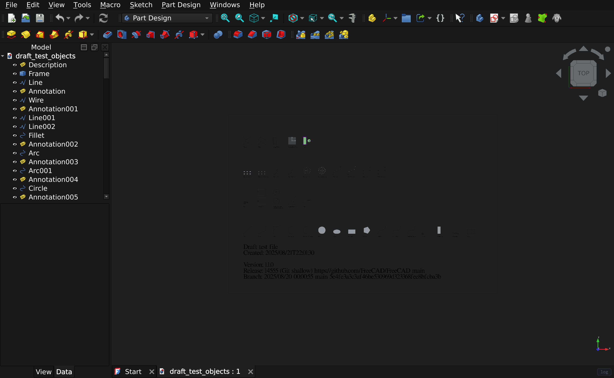
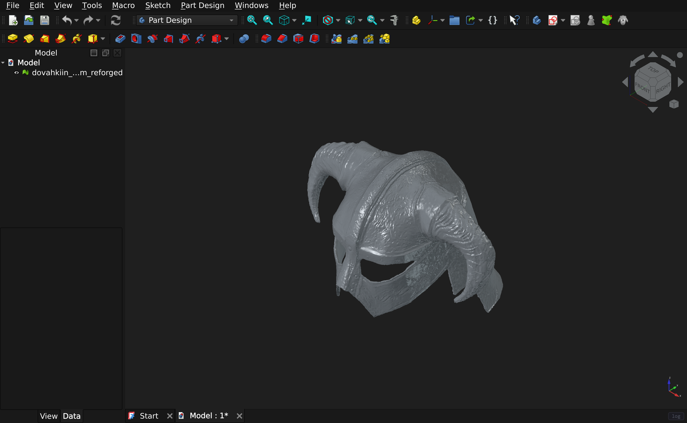

# freecad-web

**[FreeCAD](https://www.freecad.org) 1.1.3, compiled to WebAssembly and running in the browser.**
No install, no plugin, no server-side rendering. The real application, executing locally in
your tab.

👉 **<https://freecad.virtastic.app>**

[](https://freecad.virtastic.app)

<sub>A real 42 MB project, 34 top-level parts, opened from the browser. Every screenshot on
this page is the application running, captured from the shipped build.</sub>

This is not a viewer or a cut-down demo. It is upstream FreeCAD built for
`wasm64-emscripten` with wasm exceptions and JSPI: the same workbenches, the same commands,
the same OCCT geometry kernel, the same CPython interpreter running the same Python
workbenches, and the same solvers.

> Not affiliated with or endorsed by the FreeCAD project. Please report problems here,
> not to FreeCAD upstream.

## What it looks like

Every one of these opened in the browser, from the build that is live right now.

| | |
|---|---|
| [](docs/images/partdesign.png) | [](docs/images/engineblock.png) |
| **Parametric modelling.** Pads, pockets and sketches, with the full feature tree. | **EngineBlock**, 36 objects. Booleans and fillets on real solid geometry. |
| [](docs/images/bim.png) | [](docs/images/archdetail.png) |
| **BIM**, 361 objects: walls, windows, a site, a section plane and drawing sheets. | **ArchDetail**, 435 objects. Architectural detailing with materials. |
| [](docs/images/fem.png) | [](docs/images/assembly.png) |
| **FEM.** Gmsh meshes and CalculiX solves in the tab, within 1% of beam theory. | **Assembly**, 54 objects, with joints and constraints. |
| [](docs/images/draft.png) | [](docs/images/helm-stl.png) |
| **Draft**, 113 objects: wires, arcs, dimensions and text, shown from the top. | **An 18 MB STL**, imported and shaded. Meshes as well as solids. |

## Run it locally

Docker is the only thing you need. No Python, no Node, no build tools.

```bash
curl -fsSLO https://github.com/Virtastic/freecad-web/releases/download/v1.0.0/setup.sh
sh setup.sh
```

```powershell
# Windows PowerShell
irm https://github.com/Virtastic/freecad-web/releases/download/v1.0.0/setup.ps1 -OutFile setup.ps1
.\setup.ps1
```

Then open **<http://localhost:8080/>** in Chrome or Edge 137+.

The script checks that Docker is installed, running, recent enough and in Linux-container
mode, and tells you exactly what to fix if not. It then pulls the prebuilt image, starts it,
and verifies the running site actually serves correctly before saying it worked.

- `sh setup.sh --build` builds the image locally from the release artifacts (~445 MB)
  instead of pulling it.
- `sh full-build.sh` clones the repository at a tag and builds from that.
- `sh setup.sh --port 9000` serves somewhere other than 8080.

**[QUICKSTART.md](QUICKSTART.md)** covers troubleshooting, updating and uninstalling.

## What works

Verified under real mouse and keyboard input against production, not just scripted API calls:

- **All 20 workbenches** activate on first click.
- **~500 of FreeCAD's own unit tests** pass (PartDesign, Part, Draft, Sketcher, Spreadsheet,
  Mesh, Arch, TechDraw, Assembly, Materials and more).
- **Modelling.** Sketch by clicking in the viewport, add dimensional constraints through the
  modal, pad through the task panel, boolean, fillet. Geometry agrees with closed-form
  answers: a PartDesign pad measured 8262.4 mm³ against an analytic 8262.4.
- **FEM end to end.** Gmsh meshes and CalculiX solves *in the browser*, validated to within
  1% of beam theory across solids, shells, beams, plane stress, contact, frequency, thermal
  and nonlinear.
- **Files.** Open, save, save-as, export and import through FreeCAD's own menus: FCStd,
  STEP, IGES, STL, 3MF, OpenSCAD CSG, SVG, DXF.
- **The Addon Manager** lists the real catalogue and installs workbenches and macros, which
  survive a reload.
- **Your work survives a reload.** Documents autosave to browser storage on edit and are
  restored on boot.

## Send someone a link

*Edit → Share Session…* gives a link that opens your document **in your environment**: your
units, your theme, your add-ons, your macros. They need no install, no account and no
matching version, and it works whether they open it now or in three days, because the
session lives on the server rather than in your tab.

One person holds control at a time. Everyone else watches live, read-only, with the editing
commands greyed out, keeping their own camera and their own tab. Control can be requested,
granted, or taken with the editor password. Work that has not reached the server is kept as
a separate document rather than discarded.

Rendering still happens in each visitor's own browser. This is not screen sharing.

## Let an AI drive it

*Preferences → Sharing → MCP* mints one URL. Paste it into an AI client and it can see and
drive FreeCAD: the object tree, every property, the selection, the views, screenshots,
export, and every GUI command, plus arbitrary Python as the backstop. The page has copy
buttons for the Claude Code and Codex command lines, so there is nothing to type.

The assistant works inside your tab and inherits its rights, so it is off until you press
Enable. **[SHARING.md](SHARING.md)** covers both features, including what the operator turns
on and what the assistant can and cannot do.

## Requirements and limits

These are real constraints, stated up front rather than discovered:

| | |
|---|---|
| **Browser** | Chrome or Edge 137+. Firefox and Safari lack JSPI; they are refused up front having downloaded nothing. |
| **First load** | ~115 MB. Return visits fetch nothing: the engine is held in Cache Storage and reaches Ready in seconds. |
| **Memory** | A 16 GB heap ceiling (the wasm64 build; V8 caps wasm64 memory there). The app force-saves your documents and warns before it runs out. |
| **CalculiX** | Single-threaded, so large FEM jobs are slower than desktop. |
| **Shared sessions / MCP** | Self-hosters need one extra container: `docker compose --profile share up -d`. Documents you share are stored unencrypted on that server, so anyone with access to it can read them. Nothing leaves your browser until you start a session. |

## Documentation

- **[BUILD-WEH.md](BUILD-WEH.md)** is how to reproduce the production build: toolchains,
  build order, linking, staging, deploy, and a frank record of every trap that cost real time.
- **[MANUAL-QA.md](MANUAL-QA.md)** is the 20-minute human pass, scoped to the things
  automation is structurally blind to.
- **[SHARING.md](SHARING.md)** is shared sessions and the AI assistant over MCP: sending a
  link, joining one, passing control, connecting an AI client, and what the operator turns on.
- **[QUICKSTART.md](QUICKSTART.md)** is running it yourself with Docker: the three install
  paths, troubleshooting, updating, uninstalling.
- **[SECURITY.md](SECURITY.md)** is the threat model, including what is deliberate rather
  than a vulnerability.
- **[infra/README.md](infra/README.md)** is serving and deployment.

## Building

To build the *container* from a clone, use `full-build.sh` (or `full-build.ps1`). That takes
about 15 minutes and needs only git and Docker.

Building the *engine* is a different thing entirely: a multi-hour, multi-gigabyte
cross-compile of FreeCAD and its whole dependency stack.
[BUILD-WEH.md](BUILD-WEH.md) is the authority; start there.

The vendored source trees (`deps/`), toolchains (`emsdk/`, `qt/`) and build outputs are
gitignored. What this repository holds is everything needed to *recreate* them: the patch set
in [patches/](patches/), the configure and build scripts, the link commands, the front-end
shell in [play-gui/](play-gui/), and the verification harnesses in `scratchpad/`.

## License

LGPL-2.1-or-later, matching FreeCAD. See [LICENSE](LICENSE), and [NOTICE](NOTICE) for the
third-party components and their licenses. Every file this repository authors carries an
SPDX header (`tools/add-spdx-headers.py --check`, enforced by the `licensing` job in CI),
full license texts live in [LICENSES/](LICENSES), and the running app serves the same
attribution at `/legal.html`, linked from the boot screen, including Gmsh and CalculiX,
which ship as separate GPL WebAssembly modules rather than being linked in.
